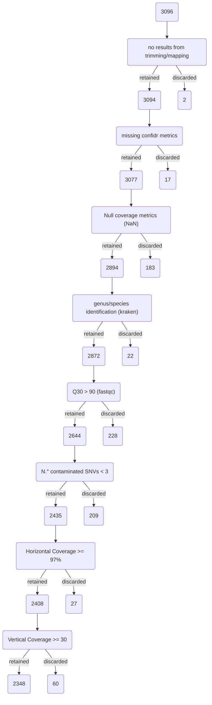

::: mermaid
flowchart LR

style IN fill:#7db4ef,stroke-width:0px,stroke:#dd1c75
style IN2 fill:#da73b3,stroke-width:0px,stroke:#dd1c75
style QC fill:#f8d953,stroke-width:0px,stroke:#dd1c75
classDef STEP fill:#ff9700,stroke-width:0px,stroke:#dd1c75
classDef OUT fill:#8bdd78,stroke-width:0px,stroke:#dd1c75

subgraph A["`**2AS_mapping**`"]
    IN("`**fastq**: 1PP_trimming 1PP_hostdepl 1PP_generated 1PP_downsampling`") & IN2([reference fasta]) --> STEP1(["`2AS_mapping
    tool: **Snippy**`"]):::STEP
    --> OUT1([consensus .fasta]):::OUT
    STEP1 --> OUT2([variants .vcf]):::OUT & QC([coverage])
end

subgraph B["`**4TY_lineage**`"]
    direction TB
        OUT1 --> STEP2(["`4TY_lineage
        tool: **Pangolin**`"]):::STEP
        --> OUT3([lineage report .tsv]):::OUT
end

subgraph L["`**Legenda**`"]
    direction TB
        in("`**Input**`")
        step("`**Tool**`")
        out("`**Output**`")
        in2("`**Reference**`")
        qc("`**Quality Check**`")

        style in fill:#7db4ef,stroke-width:0px
        style in2 fill:#da73b3,stroke-width:0px
        style step fill:#ff9700,stroke-width:0px
        style out fill:#8bdd78,stroke-width:0px
        style qc fill:#f8d953,stroke-width:0px
end
style L fill:#c9c6c8,stroke-width:0px,stroke:#d8a2f8
style A fill:#d9defa,stroke-width:0px,stroke:#d8a2f8
style B fill:#d9defa,stroke-width:0px,stroke:#d8a2f8
:::

::: mermaid
flowchart TB

style IN fill:#7db4ef,stroke-width:0px,stroke:#dd1c75
style IN2 fill:#da73b3,stroke-width:0px,stroke:#dd1c75
style STEP fill:#ff9700,stroke-width:0px,stroke:#dd1c75
style OUT fill:#8bdd78,stroke-width:0px,stroke:#dd1c75

IN(["fasta from mapping"]) & IN2(["reference genome"]) --> STEP(["`**VCF2MST**`"])
---> OUT(["MS Tree .nwk"])

subgraph L["`**Legenda**`"]
direction LR
in("`**Input**`")
step("`**Tool**`")
out("`**Output**`")
in2("`**Reference**`")

style in fill:#7db4ef,stroke-width:0px
style in2 fill:#da73b3,stroke-width:0px
style step fill:#ff9700,stroke-width:0px
style out fill:#8bdd78,stroke-width:0px
end

style L fill:#eedef7,stroke-width:0px,stroke:#d8a2f8
:::

::: mermaid
flowchart TB

style E fill:#f62157,stroke-width:0px
style G fill:#da73b3,stroke-width:0px
style A fill:#c87deb,stroke-width:0px
style B fill:#7db4ef,stroke-width:0px
style F fill:#8bdd78,stroke-width:0px
style C fill:#f8d953,stroke-width:0px
style D fill:#ff9700,stroke-width:0px

E(#f62157) -->
G(#da73b3) -->
A(#c87deb) -->
B(#7db4ef) -->
F(#8bdd78) -->
C(#f8d953) -->
D(#ff9700)

:::

